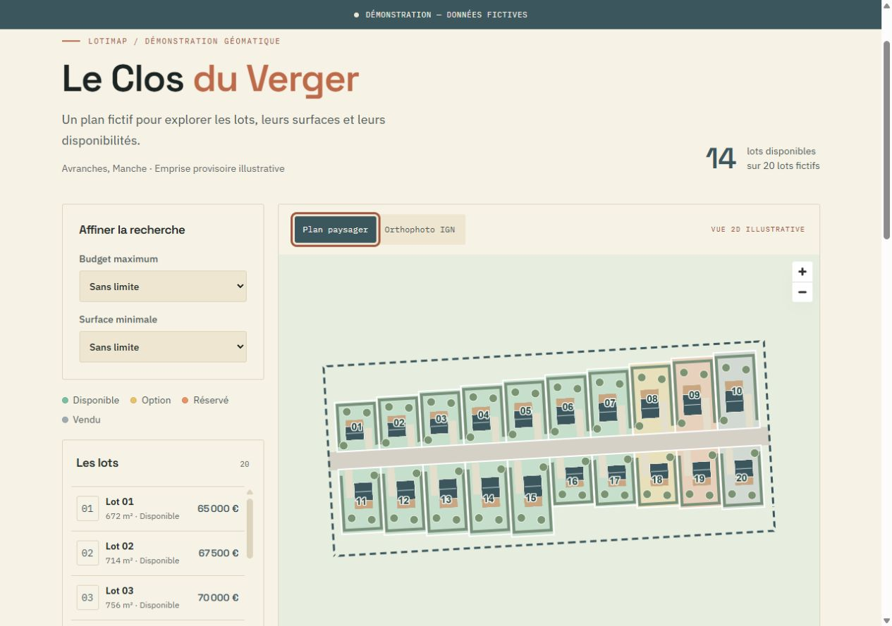
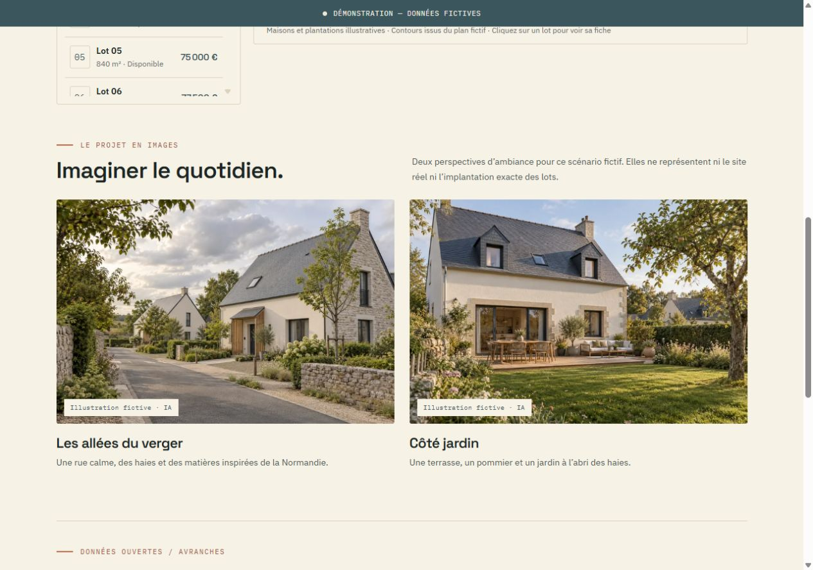

# lotimap

[](https://github.com/Yanis1650/lotimap/actions/workflows/ci.yaml)

[Français](README.md)

> **Demo — fictional data.** No property is offered for sale and no personal data is collected.

From CAD to a web map: **lotimap** turns a surveyor's DXF into validated GeoJSON, then displays lots in an interface designed for mobile and desktop. This portfolio project focuses on conversion quality, readable code and explicit limitations, with a target budget of roughly 25 hours. The demo interface is in French.



## Problem and demonstration

A surveyor's drawing contains layers, polylines and text, rather than ready-to-use geographic polygons with reliable numbers and areas. The converter separates DXF reading, geometry checks, label matching and coordinate transformation. A YAML mapping adapts the layer names to different drawings.

**“Le Clos du Verger”** is a fictional subdivision with 20 lots near Avranches, France. Its provisional footprint is centred at 48.684° N, 1.357° W and represents no real development.

- **Conversion:** Lambert 93 or CC49, areas in the source CRS, WGS84 GeoJSON and a validation report.
- **Public map:** a 2D landscaped plan or IGN orthophotos, four statuses, budget/area filters, a collapsible list that returns to the map on selection, and lot details.
- **Lightweight 3D view:** fictional house and planting volumes, rotation, zoom and recentering within the same map.
- **Perspectives:** two realistic atmosphere illustrations, explicitly fictional and AI-generated.
- **Administration:** update fictional prices and statuses in SQLite using an environment-provided password.
- **Enrichment:** GPU zoning per lot, municipal risk families and a DVF median, computed in advance.



## Run the map

### Development

Install **Node.js 22.22.2 or newer within the 22 release line**, then from the repository root:

```sh
cd web
npx --yes npm@12.2.0 ci
npm run dev
```

Open [http://127.0.0.1:3000](http://127.0.0.1:3000). The plan and enrichment are included; SQLite initializes fictional values on the first request. IGN orthophotos require an Internet connection. Administration stays disabled until its two environment variables are set; see [web/README.md](web/README.md), in French.

### Docker

With recent Docker and Docker Compose versions, from the repository root:

```sh
docker compose -f deploy/compose.yaml -f deploy/compose.local.yaml up --build -d --wait
```

Open [http://127.0.0.1:3333](http://127.0.0.1:3333). A named volume preserves prices and statuses. See [deploy/README.md](deploy/README.md) for VPS configuration, Traefik variables, credentials and SQLite backups.

## Generate and convert a drawing

With [uv](https://docs.astral.sh/uv/) installed, from the repository root:

```sh
uv python install 3.12
uv run --locked --python 3.12 samples/generate.py
uv sync --project importer --locked --group dev
uv run --project importer --locked lotimap-import data/demo/dxf/clos_du_verger_clean.dxf --layers importer/config/layers.example.yaml --source-crs EPSG:3949 --output data/demo/geojson/clos_du_verger.geojson --report data/demo/geojson/validation.json --strict
```

The generator creates a clean drawing and five broken variants: an open contour, a missing number, a duplicate number, an orphan label and a self-intersecting polygon. Centre, rotation and dimensions are configurable. Identical parameters produce identical files.

Use `--source-crs EPSG:2154` for Lambert 93. The converter does not infer the drawing's CRS; the user must supply it correctly. `--strict` returns a failure when issues exist, for use in CI. Without it, usable entities are exported while anomalies are reported.

See [the generator](samples/README.md) and [the converter and layer mapping](importer/README.md). Recompute enrichment after changing the GeoJSON:

```sh
uv run --project importer --locked python -m enrichment.build
```

The municipality, DVF period and paths are CLI options. [The enrichment documentation](enrichment/README.md) describes thresholds and limitations.

## Architecture

```text
samples/ ──▶ synthetic DXF ──▶ importer/ ──▶ WGS84 GeoJSON
                                                  │
open data ──▶ enrichment/ ◀────────────────────────┘
                  │                               │
                  ▼                               ▼
           enrichment.json ──▶ Nitro API ◀──────── SQLite
                                    │
                                    ▼
                           Vue 3 + MapLibre GL
```

- `importer/`: Python 3.12, ezdxf, Shapely, pyproj, Typer, YAML, pytest and Ruff.
- `samples/`: deterministic CC49 DXF generator, with a uv script lockfile.
- `enrichment/`: Python calculations sharing the converter's environment.
- `web/`: Nuxt 4, Vue 3, TypeScript, MapLibre GL, Nitro and better-sqlite3.
- `data/demo/`: fictional drawing, GeoJSON, validation report and aggregated open data.
- `data/private/`: optional local files, excluded from Git and the Docker build context.
- `deploy/`: two-stage Docker image, separate local and Traefik configurations.
- `.github/workflows/ci.yaml`: Python, web and container checks, without automatic deployment.

## Technical decisions

**Geometry first.** Areas are calculated in metres in the source CRS, before transformation. Labels are matched by their position; a label on a shared boundary is reported as ambiguous.

**Nuxt and SQLite.** One service provides the pages and server routes. A SQLite file is sufficient for 20 lots and one administrator. Existing values survive startup. This demo uses one instance, without replication or external authentication.

**Precomputed open data.** GPU, Géorisques and DVF requests do not slow down browsing. The output records its dates and the GeoJSON SHA256 hash. Changing the drawing hides the enrichment until it is recalculated. `.gitattributes` prevents Git from changing GeoJSON line endings, preserving the hash across Windows and Linux.

**Reproducible installation.** Local development, Docker and CI use npm 12.2.0. `allowScripts` approves the locked versions of esbuild and the ESLint resolver. SQLite 13 ships native binaries; automatic rebuilding is disabled to avoid an npm 10 installation failure on Windows. See [npm install-script management](https://docs.npmjs.com/cli/v12/commands/npm-install-scripts/).

**Simple deployment.** Debian uses the Linux SQLite binary shipped with the package. The final image contains Nitro output and demo data; it runs without root, with a read-only filesystem and a writable SQLite volume. Credentials are supplied at runtime.

**Readability.** Every hand-written code file is limited to **200 physical lines**, including tests and CSS. A persistent rule and a pytest check enforce this. npm and uv dependencies are locked.

**Drekky Studio identity.** The supplied guidelines are applied: cream, slate, terracotta accents, Space Grotesk, IBM Plex Sans and IBM Plex Mono. SVG logos and fonts are served locally. [Visual decisions and asset rights](docs/branding.md) are documented in French.

**Landscaped plan and images.** An illustrative layer places houses and plants inside the fictional lots without changing their boundaries or areas. The perspectives do not represent the plan's exact layout. [The method, limitations and prompts](docs/visuals.md) are documented in French.

**Lightweight 3D.** Native MapLibre layers extrude the illustrative geometry, with fictional heights over flat ground. The browser keeps the same map and data across all three modes. [Decisions, controls and limitations](docs/3d.md) are documented in French.

## Checks and CI

From the repository root:

```sh
uv run --project importer --locked python -m pytest -q importer/tests enrichment/tests
uv --directory importer run --locked ruff check src tests ../samples ../enrichment
uv --directory importer run --locked ruff format --check src tests ../samples ../enrichment
```

From `web/`:

```sh
npm run lint
npm run typecheck
npm test
```

The 18 Python tests cover conversion, damaged inputs, projections, mappings, aggregations and file length. The web integration test starts the compiled server with a temporary database and checks login, refused access, validation, editing, logout and stale enrichment. ESLint checks Vue, TypeScript and JavaScript.

Three additional web tests check that landscaping stays inside the lots without mutating the plan, follows filters and skips unsupported shapes.

A fifth web test validates the 2D/3D layers against the native MapLibre specification. Geometry checks also verify that every volume belongs to its identified lot.

GitHub Actions runs these checks on pushes and pull requests, then builds and starts a test container. Its health check requests `/api/lots`, exercising the bundled data and SQLite. The container test checks persistence across restart, the HTTPS cookie, `noindex` and `robots.txt`. Enrichment tests use synthetic data without querying external services. All three jobs passed on the [first GitHub run, on 4 October 2026](https://github.com/Yanis1650/lotimap/actions/runs/37219417210).

**Dependency status on 4 October 2026.** `npm audit` reports 11 affected dependencies from two advisories: [braces](https://github.com/advisories/GHSA-vfj7-8cjw-p6xm) and [node-forge](https://github.com/advisories/GHSA-86w9-cpqp-85rv), with no patched version published. These modules are pulled in by Nuxt development/build tools and are absent from the inspected Nitro server output. The development server listens only on `127.0.0.1`. Review these advisories before deployment and apply available fixes; audit results are not suppressed.

## Scope and limitations

- The converter supports closed 2D `LWPOLYLINE` and `POLYLINE` contours **without curves**. Blocks, curves and other configured entities are reported and skipped. An unreadable file produces an error report.
- The mapping adapts layers, not every CAD convention. Footprint, layers and CRS need checking for each new import.
- Risks are municipal, not located on individual lots. A PLU zoning code does not guarantee buildability.
- DVF is an aggregate indicator with municipal-export and deduplication limitations. Commercial prices in the demo remain fictional.
- Administration is deliberately minimal; login attempts are limited in memory for a single instance.
- Domain and VPS settings must be supplied before public deployment.

## Sources, dates and licences

The drawing, lots, prices and statuses are fictional. No owner data or cadastral reference is published, and raw DVF CSV files are not retained.

- **IGN Géoplateforme / WMTS orthophotos:** [service and attribution](https://cartes.gouv.fr/aide/fr/guides-utilisateur/utiliser-les-services-de-la-geoplateforme/diffusion/wmts/), consulted **30 September 2026**.
- **IGN, API Carto / GPU:** [source](https://www.data.gouv.fr/dataservices/api-carto-module-geoportail-de-lurbanisme-gpu), consulted **1 October 2026**. All 20 provisional lots intersect zone Uh; the document carries the date **27 February 2020**.
- **Géorisques, Ministry / BRGM, GASPAR:** [source](https://www.georisques.gouv.fr/donnees/bases-de-donnees/procedures-administratives-relatives-aux-risques), [terms](https://www.georisques.gouv.fr/cgu), consulted **1 October 2026**. Seven risk families recorded for Avranches.
- **DGFiP, Etalab / DVF processing:** [raw source](https://www.data.gouv.fr/datasets/demandes-de-valeurs-foncieres), [geolocated exports](https://www.data.gouv.fr/datasets/demandes-de-valeurs-foncieres-geolocalisees), consulted **1 October 2026**. Median **€80/m²**, based on **12 transactions from 2021 to 2025**.

These open data sources are attributed under the [French Open Licence 2.0](https://www.etalab.gouv.fr/licence-ouverte-open-licence/). DVF terms prohibit re-identification and external indexing. All pages carry `noindex` metadata and the `X-Robots-Tag` header; `robots.txt` disallows crawling. These directives rely on crawlers respecting them.

Source code, documentation and synthetic drawings use the [MIT licence](LICENSE). Fonts use the SIL Open Font License; data and logos retain their own rights as described in [NOTICE.md](NOTICE.md). [CONTEXT.md](CONTEXT.md) records the project status and decisions in French.
