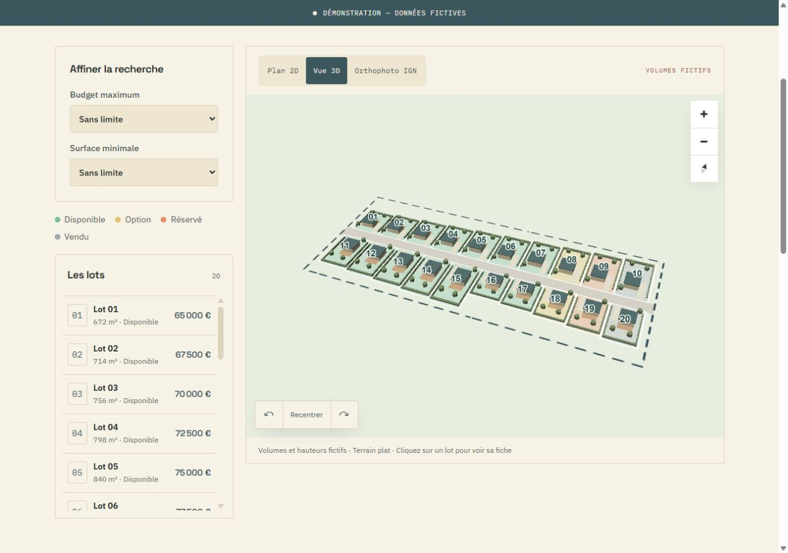

# Vue 3D illustrative

## Décision

La phase 9 ajoute une vue 3D légère, choisie par l'utilisateur le 5 octobre 2026. Elle utilise les couches natives `fill-extrusion` de MapLibre GL 6.11.2. Aucun moteur 3D ni modèle distant n'est ajouté à l'application. Le plan paysager 2D reste l'affichage initial ; l'orthophoto IGN reste disponible.

Une maquette architecturale détaillée demanderait des modèles dédiés, leurs droits, une préparation des assets et des contrôles supplémentaires sur mobile. Elle reste hors du périmètre de cette étape.

## Géométrie et hauteurs

Les volumes sont dérivés de la même couche illustrative que la 2D. Maisons, débords de toiture, haies, troncs et couronnes des arbres restent dans les lots fictifs. Chaque élément porte l'identifiant stable du lot, ce qui permet de sélectionner le bon lot depuis un toit ou une plantation en volume.

Les hauteurs sont des constantes de démonstration, en mètres : murs 4,2 ; toiture simplifiée entre 4,2 et 4,7 ; haies 1,3 ; troncs 2,3 ; couronnes entre 2,3 et 4,8. Les toits sont des plateaux ardoise, les arbres des volumes polygonaux stylisés. Ces formes ne reproduisent pas l'architecture des perspectives d'ambiance.

Le terrain est plat : aucune altitude, pente, ombre solaire, orientation d'ensoleillement ou règle de construction n'est calculée. L'éclairage sert uniquement à lire les volumes. Les surfaces et les contours du GeoJSON source restent inchangés ; l'enrichissement conserve son empreinte de référence.

## Interaction

- `Plan 2D`, `Vue 3D` et `Orthophoto IGN` utilisent la même instance de carte et les mêmes filtres et fiches.
- Entrer ou sortir de la 3D rétablit un cadrage d'ensemble ; la vue 3D initiale est inclinée de 50°, avec un azimut de −25°.
- Les boutons de rotation tournent la vue de 30° ; `Recentrer` rétablit le cadrage du mode actif.
- Les commandes ont une zone de clic d'au moins 44 × 44 px et un nom accessible en français. La liste des lots reste une alternative à la carte.
- Les transitions de caméra utilisent les animations natives non essentielles de MapLibre, qui respectent la préférence de réduction des animations.
- La mention visible « Volumes et hauteurs fictifs · Terrain plat » accompagne la carte en 3D.

## Contrôles

Les tests de géométrie vérifient les éléments 2D et 3D dans leur lot identifié, sans modifier le plan. Le test `web/tests/map-style.test.mjs` valide les couches des trois modes avec la spécification native MapLibre. Son validateur est une dépendance de développement explicitement déclarée, déjà présente dans le verrouillage de MapLibre.

La vérification visuelle couvre 1 280 × 900 et 390 × 844 : clic sur une maison, filtres combinés, changement de mode, rotation, zoom et recentrage. Les captures sont dans `docs/images/lotimap-3d-desktop.png` et `docs/images/lotimap-3d-mobile.png`.

[Capture sur téléphone, après zoom](images/lotimap-3d-mobile.png).

## Références techniques

Documentation officielle consultée le 5 octobre 2026 :

- [Couches `fill-extrusion`, hauteurs et bases](https://maplibre.org/maplibre-style-spec/layers/#fill-extrusion).
- [Options de caméra : inclinaison et azimut](https://maplibre.org/maplibre-gl-js/docs/API/type-aliases/CameraOptions/).
- [Cadrage d'une emprise](https://maplibre.org/maplibre-gl-js/docs/API/type-aliases/FitBoundsOptions/).
- [Options d'animation et réduction des animations](https://maplibre.org/maplibre-gl-js/docs/API/type-aliases/AnimationOptions/).
